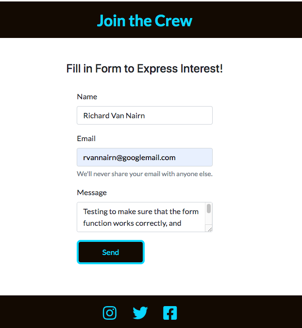
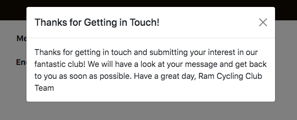
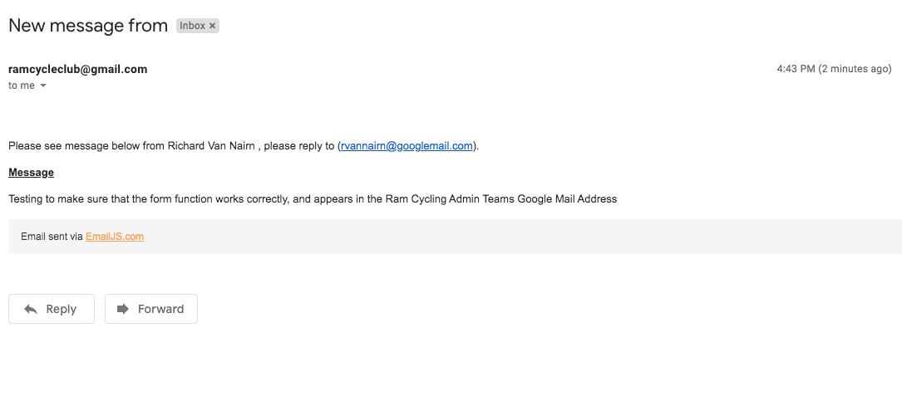

# Testing

<a href="README.md">Main README file</a>

I used <a href="https://validator.w3.org/"> Markup Validation Service</a>,  <a href="https://jigsaw.w3.org/css-validator/">CSS Validation Service</a> and <a href="https://jshint.com/">JSHint</a> to check both HTML, CSS and Javascript using the direct input function of both services. CSS and Javascript came back with no issues flagged. However, Markup Validation Service came back with two warnings in my HTML code. These warnings indicated that there was use of unnessary Javascript in lines 17 and 18. After some investigation according to the EmailJS website both scripts are required in order to connect my form to EmailJS services, so I have left them in the code. 

I used Chromes inspect feature Lighthouse on my page, to improce the sites perfoamnce. The report found the following: 

* <b>Performance</b> - Scored 46 for Desktop and 88 for Mobile - This was the lowest scoring part of the Lighthouse test for this site. The main points of criticism was "Time to Interactive", "Speed Index" and "Largest Contentful Paint". I was expecting that the creative decision to have a large image within the header would cause the website to score low when it came to load time, but hadn't taken into considersation how much this would effect the score. Following the test I experimented with different codecs and replaced a number of PNG's with compressed JPEG's in an attempt to improve this, but to now avail. 

* <b>Accessibility</b> - Scored 91 for Desktop and 88 for Mobile - This was a high scoring part of the Lighthouse test. The test flagged up small issues like "Heading elements are not in a sequentially-descending order" and "Links do not have a discernible name". However, all of these comments don't effect the overall performance of the site and are linked to creative decisons to prioritise the aesthic design by having the navigation bar at the top of the header, and use Font Awesome icons instead of text to link the cycling clubs social media accounts in the footer of the site.  

* <b>Best Practices</b> - Scored 87 for Desktop and 93 for Mobile - Another high scoring sectiong of the Lighthouse test, only significate suggestion flagged was "Links to cross-origin destinations are unsafe". When you link to a page on another site using the target="_blank" attribute, you can expose your site to performance and security issues. Its suggested to use "<rel="noopener">" in the social media icon links. This improved the results in the Best Practices section. 

* <b>SEO</b> - Scored 90 for Desktop and 92 for Mobile - Again another high scoring section of the Lighthouse test, and only received limited suggestions none of which were applicable to the improved running of the site. 

## Testing client Requirements featured in README

* ###  We need a platform that illustrates and shares our key values.

No matter what section of the site the visitor is currently enhabiting, they have the abilty to navigate to the "About Us" section of the site using the navigation bar or by scolling to that section. The "About Us" section contains key information and explains the cycling clubs key values with the help of her images that echo the connotation of the text. 

* ###  We need a platform that depicts and captures the clubs brand image. 

I've created a banner within the header of the site. Its use is to capture the main ethos of the cycling club. Although its quite a large piece of relastate for a single element of the site its of high importance. It presents the vistor with the clubs logo, which colors and feel echo back to historic cycling clubs. The colours have been used extensivly throughout the site, keeping a consistent theme running through the webiste. The use of Lato font family gives the logo a quirky fun appearance, and I've continued to use this font family throughout the site. All of these characteristics are tied together with a cycling hero image used as the banners background. 

* ###  We need a platfom that succinctly explains who we are and the function of the club to the local cycling community.

I have deployed the three main sections of this website in order of importance. The "About Us" section appears first and is easy to a visitor to navigate to using the navigation bar, or scolling to it. Its main purpose is to succinctly express the clubs main function and how they are connected to local community. The club is passionate about the local community as its named after a important piece of local history. This is evident to the visitor from the text within the paragraphs and hero images. 

* ###  We need a platform that politely gives an indication of the phyiscal requirments potential memebers need to poses in order to be an active memeber. 

Informaiton on physical requirements is mentioned briefly within the "About Us" seection. However, its also mentioned within the "Club Ride" section of the site. I've employed the use of Google Map API specifically Maps Javascript API and Directions API to render the groups main club rides onto a map. One ride takes place every Saturday and the second ride takes places mid week at lunch time. Not only do the routes render on the map once the respecitive buttons are clicked, but key information appears within a new div. This information includes total distance of the routes, which give the vistior an indication on the fitness level required in order to complete the routes.  

* ###  We need a platform that not only informs potential new memebers of why they should join the club, but give them the oppertunity to express interest in joining. 

The whole site acts as a advert for why someone should join the cycling club. The "About Us" section informs the visitor about the clubs history and what they offer there current memebers. The "Club Ride" section advertises the clubs two routes using an interactive Javascript element to render the route on a map. This reinforces the key selling points highlighted in the "About Us" section, that of a collobrative and team spirit. Once the "About Us" and "Club Ride" section have sold the club experience to the vistor, then the form within the "Join the Crew" section. Once the form is submitted it will be emailed to the club admins Googlemail address using EmailJS. The admin team are then able to progress that enquiry in the hope of adding a new member to the club. 

## Testing User Stories from UX section in README

### Testing First Time Visitor Goals
1. As a First Time Visitor, I want to easily understand the main purpose of the site, and learn more about the orgaization. 
    * About Us section features 5 paragraphs explaining the cycling clubs values, with hero images to reinforce those connotations. 

1. As a First Time Visitor, I want to be able to easily navigate through the site to find key content
    * No matter the section the visitor is on, they can navigate betwween the sections on the site using the navigation bar found within the header. 
    * The Navigation Bar on smaller devices toggles to a remote view. This still allows the visitor to navigate across the site, without compromisng the readabilty of important information. 
    * Colours used for hover selectors remains consistant through out the site. Whether the link is used for navigating to internal sections, or extenal social media accounts the user assocaites the colours used with the function. 

1. As a First Time Visitor, I want to clearly find out what makes this organization different from its competitors.
    * The "About Us" section features four paragraphs explaining the clubs unique selling points over other local cycling clubs. It also features hero images in add to that explanation. 

1. As a First Time Visitor, I want to source information that validates the organizations legitimacy, are they a respected club to be assocaited with as a memeber. 
    * In the footer of the site are three social icons linked to the clubs social media sites. The sites open up in a different tab, so the visitor can contiune their journey though the website without being diverted to a different website. 

### Testing Returning Visitor Goals
1. As a Returning Visitor, I want to be able to navigate to see whether any new routes have been added to the group. 
    * Using the Navigation Bar a returning visitor can quickly find the "Club Ride" section where club routes are featured. The Navigation Bar is sticky meaning it always stays at the top of the page, allow the visitor to easly navigate to the "Club Ride" section no matter there location. If any new routes have been added a new call to action button will have appeared. This button will have the name of the route, and once clicked will render the route and display key information relating to it. 

1. As Returning Visitor, I want to navigate to the sign up section.

    * Using the Navigation Bar a returning visitor can quickly find the "Join the Crew" section where the sign up form is featured. The Navigation Bar is sticky meaning it always stays at the top of the page, allowing the visitor to easly navigate to the "Join the Crew" section no matter there location. Once there the form is simple to complete and with 4 clicks the visitor can submit interest. 

## Manually Testing Website features

### Navigation
* Load of Website. 
* Right click and select inspection.
* Change the screen size from desktop to tablet, then change from tablet to smaller devices and verify that the navigation bar is responsive. 
* Confirm that the text in the navigation buttons isn't restricted by differing screen sizes. 
* Verify that small screen sizes result in the navigation bar to toggle into remote view using a nav button. 
* Once navigation bar goes into remote view, press nav button and confirm that links appear in drop down.
* Press each link in turn and confirm that you are transported to the relative section of the website. 
* Go back into desktop view and hover over the navigation links, make sure the hover selection function works for each link.
* Click each link and make sure you are transported to the correct section of the site. 
* Repeat verfication of functionality and responsiveness on iPhone and iPad.  

### About Us Section
* Load of Website. 
* Right click and select inspection.
* Scoll down the page to About Us Section. 
* Change screen size from desktop to tablet, then change from tablet to smaller devices and verify hero images and text are appearing as designed. For X Large and Large screen sizes text and one hero Image should appear. Medium screen sizes two hero images should appear along with the text. Finally small screen sizes and below only the text should appear and no hero images. 

### Club Ride Section
* Load of Website. 
* Right click and select inspection.
* Scoll down the page to Club Ride Section.
* Change the screen size from desktop to tablet, then change from tablet to smaller devices, verify that the map, and both the call to action buttons appearance isn't effected by differing aspect ratios. 
* Hover over call to action button for both Lunch Time Ride and Saturday Ride, confirm that hover function works. Buttons text and borders should be Vivid Sky Blue and background Smoky Black. However, when the mouse runs over the button the colors invert so the background is Vivid Sky Blue and buttons and text are Smoky Black. 
* Peform the following manual check <b>CLUB RIDE > CLICK "Saturday Ride" BUTTON</b> the appropriate route should appear on the amp. In additon key informatiom to the route should appear in a new div detailing routes Meeting Point, Ending Point and Duration. 
* Peform the following manual check <b>CLUB RIDE > CLICK "Lunch Time Ride" BUTTON</b> the appropriate route should appear on the amp. In additon key informatiom to the route should appear in a new div detailing routes Meeting Point, Ending Point and Duration. 

### Join the Crew
* Load of Website. 
* Right click and select inspection.
* Scoll down the page to "Join the Crew" Section.
* Change the screen size from desktop to tablet, then change from tablet to smaller devices, verify that the forms appearance isn't effected by differing aspect ratios. 
* Click the call to action button labelled "Send" without filling out any of the form, confirm that warning  requesting to fill in outstanding fields. 
* Fill in the "Name" field and then click the call to action button labelled "Send", confirm that you get a warning requesting to fill in outstanding fields. 
* Repeat above process for both "Email" and "Message" fields to confirm that the empty field warnings are working as designed. 
* Fill in all of the fields as displayed in the image below, then click the the call to action button labelled "Send". Providing you are still in inspect mode when you check this you should see "SUCCESS!" confirming the form was submitted successfuly. 

* When you perform the previous process a modal should also appear informing the visitor what will happen following the submission of there form. I've included an image below of what this should look like: 

* Click the X in the top right hand corner of the modal to close it, confirm that the form as reset. 
* Log into the Ram Cycling Admin Teams Googlemail address, an unread email should be in the inbox, with the information you previously submitted in the form. I've included an image below of what this should look like: 

### Footer
* Hover over each social media icon and confirm color of hover select function is working as designed. Color should be Vivid Sky Blue and turn Rufous once mouse hovers over the icon. 
* Perform the following manual check: <b>HOME > SCROLL to FOOTER > CLICK ICON</b>. When you click the icon a new tab whould open with the clubs relevant social media account. 
* Reduce screen size to verify that the icon's size is responsive, and they remain centered. 
* Also confirm the footer itself is responsive by decreasing and increasing screen sizes. 

## Further Testing

* Viewed this webiste on various devices including iPhone 11, iPad Pro, Microsoft Surface, iMac Pro and Dell Latitude 5410, with no reports of issues found. 

* Completed the manual testing steps mentioned above on various browsers, including Safari and Firefox with no issues flagged. 

* Sent link of website to family and friends for them to check over the site. It was also reported that the images within the header took a whole to load. 

## Known Bugs

* Load up time of of the sites header could be shorter. More time is needed experimenting with different codecs and files sizes, that don't compromise the aesthetics of the site. 

